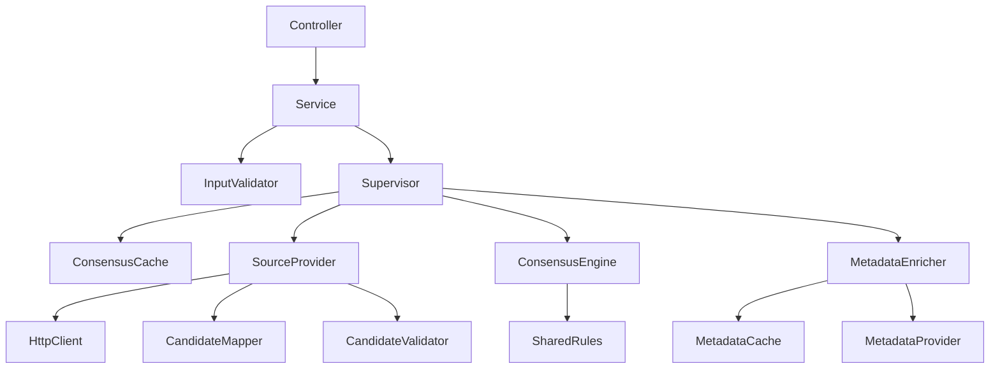

# Service architecture

The food lookup workflows now have separate service, supervisor, validator, source-adapter, and consensus responsibilities. This is an internal refactor: endpoints, request/response JSON, API version, ranking formulas, source priorities, quantity scaling, and cache durations remain unchanged. No database migration or mobile app update is required.



## Responsibilities

| Component | Owns | Must not own |
| --- | --- | --- |
| Services | Normalize and validate incoming lookup requests, delegate to supervisor | Upstream calls, ranking, cache refresh |
| Input validators | Search minimum length, barcode normalization and checksum | Network or database access |
| Supervisors | Parallel lookup steps, optional fallbacks, cache refresh, metadata enrichment, completion logs | Provider JSON parsing or ranking mathematics |
| Source providers | Call typed clients with existing time budgets and availability gates, measure latency, adapt responses | Cache policy or response serving sizes |
| Candidate mappers | Convert upstream DTOs into internal candidates | Network calls or cache writes |
| Candidate validators | Existing candidate eligibility and plausibility rules | Source scheduling or aggregation |
| Consensus engines | Identity alignment, clustering, source agreement, confidence, grade selection | I/O, application configuration, cache writes |
| Response mappers | Build fresh response DTOs and scale for the requested quantity | Mutate cached consensus values |
| Metadata components | Metadata lookup, matching, hit/miss caching, duplicate-request sharing, per-search fan-out | Nutrition ranking or scaling |
| Shared rules | Text matching, external-field extraction, robust aggregation, common cache/source policies | Endpoint-specific orchestration |

## Where to start

- Request entry points: `Infrastructure/Services/Foods/ConsensusBarcodeService.cs` and `ConsensusFreshFoodsService.cs`.
- Workflow order: `Infrastructure/Supervisors/Foods/BarcodeSupervisor.cs` and `FreshFoodsSupervisor.cs`.
- Input and candidate rules: `Infrastructure/Validators/Foods/`.
- Barcode mapping, source adaptation, and consensus: `Infrastructure/Services/Foods/Barcode/`.
- Search mapping, source adaptation, and consensus: `Infrastructure/Services/Foods/Search/`.
- Metadata enrichment: `Infrastructure/Services/Foods/Metadata/`.
- Shared matching, aggregation, field extraction, and policies: `Infrastructure/Services/Foods/Shared/`.
- Per-key consensus refresh coordination: `Infrastructure/Services/Foods/Abstract/ConsensusCacheCoordinator.cs`.

The public supervisor interfaces live under `Core/Interface/Foods/Supervisors/`. Supervisors receive already-normalized inputs from the services. Engines, internal pipeline models, adapters, and validators stay internal to Infrastructure. Tests have friend-assembly access to verify the pure rules and cache coordination without expanding the public API.

Dependency registration is separated into `FoodServiceRegistration`, `ApplicationServiceRegistration`, and `PersistenceRegistration`. Persistence setup registers the DbContext and repositories; it no longer owns food workflow or authentication service registration.

## Data flow and lifetimes

Candidates and cached consensus values represent the provider's standard quantity. A response mapper constructs a new `FoodDto` for each request and scales that DTO; different quantities reuse the same source cache. Metadata dictionaries are cloned before attaching them to responses so callers cannot modify cached metadata.

Food services, supervisors, source providers, and metadata components are singletons, matching the existing lookup lifetime. Shared refresh coordination prevents duplicate work per cache key. Dependencies must remain safe for concurrent requests; do not inject a scoped DbContext or meal/user repository into these singleton components. Authentication and meal services remain scoped.

Source calls still use `SourceCallExecutor`, `SourceSettingsResolver`, and the existing source availability gate. Search queries USDA and OpenFoodFacts first, then GTIN only when primary results are insufficient. Barcode lookup chooses a product anchor before fetching identity-aligned supporting candidates. Algorithms and fallback thresholds were extracted without changing their formulas.

Empty or weak background refreshes preserve the previous successful consensus. Metadata has a shared cache with distinct barcode/search key prefixes, positive and negative entries, and per-key in-flight request sharing. Search metadata fan-out remains bounded per search request; this is not a global process-wide concurrency limit.

Successful workflow logs now come from supervisor logger categories; upstream metadata logs come from the metadata provider. Controller request logs and service rejection logs remain. Update category-specific logging filters if they previously matched only the old consensus service categories.

## Making changes

1. Change input acceptance rules in an input validator and cover accepted/rejected examples in `FoodRulesTests`.
2. Change a provider response mapping in its candidate mapper; use a fixture containing that provider's payload shape.
3. Change relevance, confidence, or aggregation behavior in the relevant consensus engine or shared rule, with deterministic expected results.
4. Change workflow order or fallback conditions in a supervisor, with source-call-count and failure-path tests.
5. Add a provider by registering its typed client, adding source adaptation and settings, then wiring it into the appropriate supervisor. Keep provider-specific DTOs out of the supervisor.

The small auth and meal services keep their direct repository/token-handler dependencies. They did not need an extra supervisor forwarding layer. `MealServie` was renamed to `MealService`, the auth response copy was removed, and the unregistered legacy generic cache services were removed after checking their references.

## Verification

`ConsensusServiceTests` captures serving-size independence, metadata isolation, invalid inputs, shared concurrent refreshes, failures, stale-result preservation, provider fallbacks, and identity alignment. `FoodRulesTests` covers normalization, checksum and candidate rules, and aggregation. `FoodCacheTests` covers concurrent work sharing, negative caching, and recovery after exceptions. Existing HTTP and PostgreSQL regression tests remain in place.

When Docker watch is running, use an isolated host build directory to avoid competing writes to the mounted `obj` files:

```sh
dotnet test Tests/Tests.csproj --artifacts-path /tmp/scaleio-verification
```

The PostgreSQL test still requires `TEST_DATABASE_URL` pointing to a dedicated test database. CI supplies that setting.
